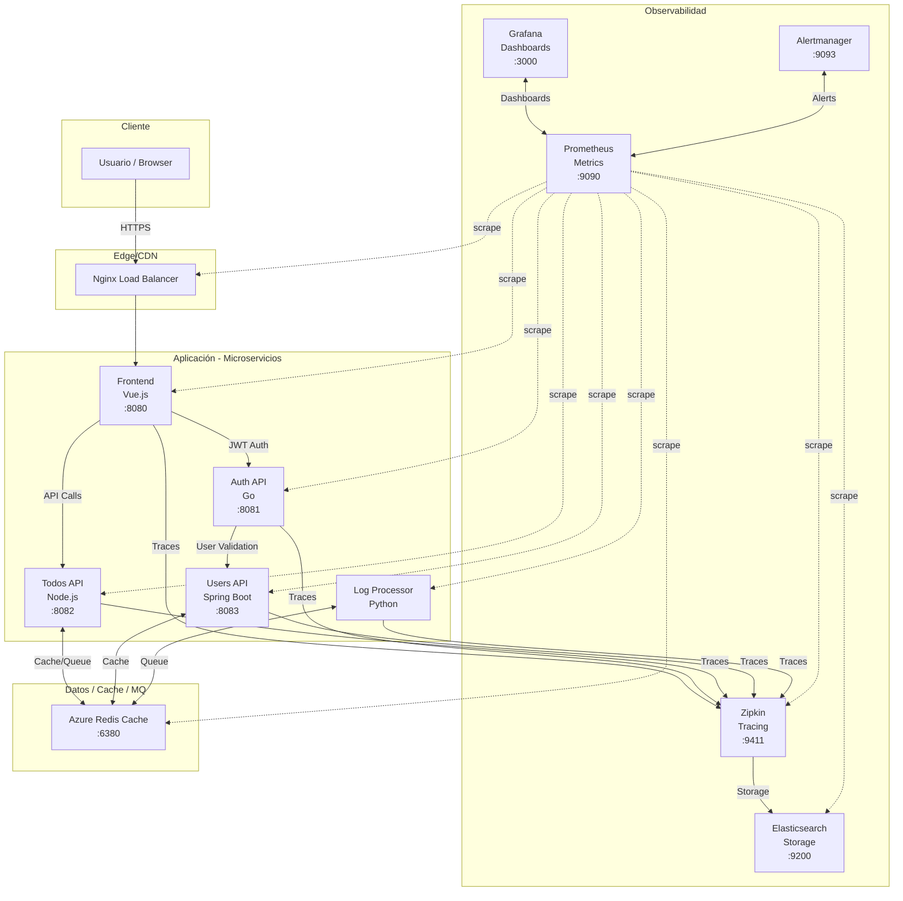
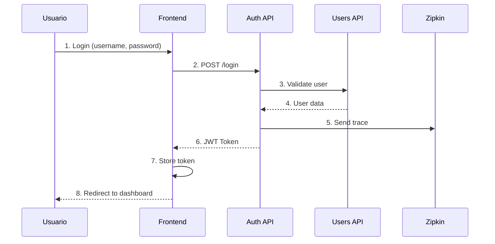
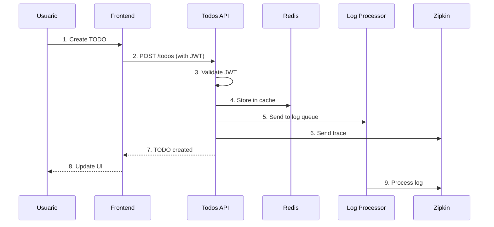
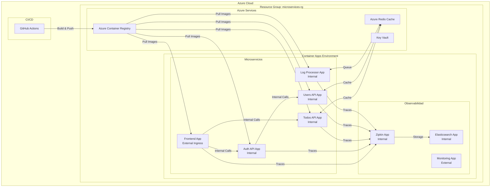
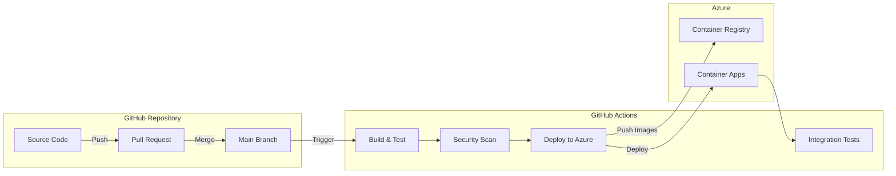
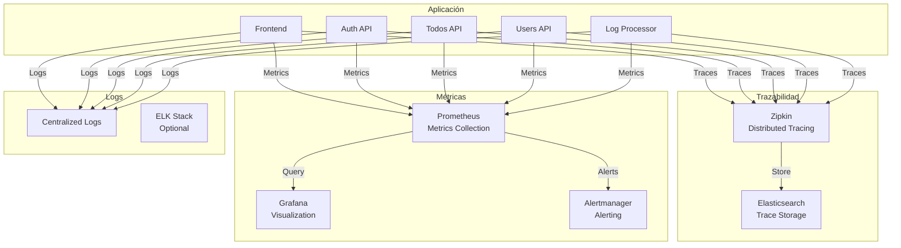
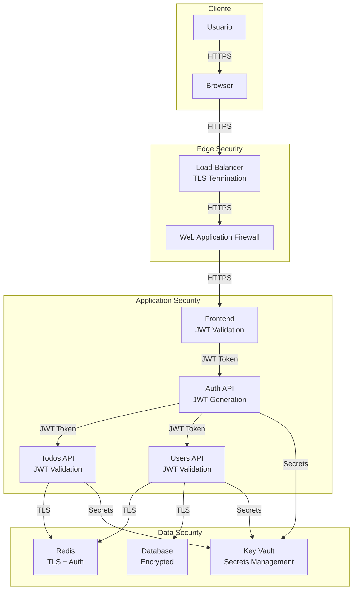
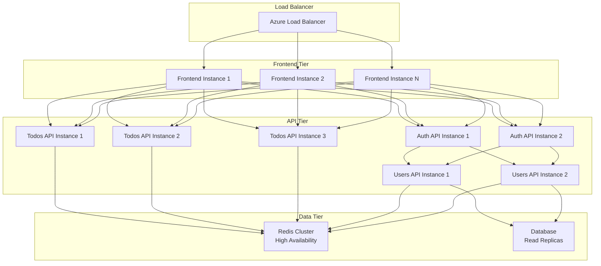
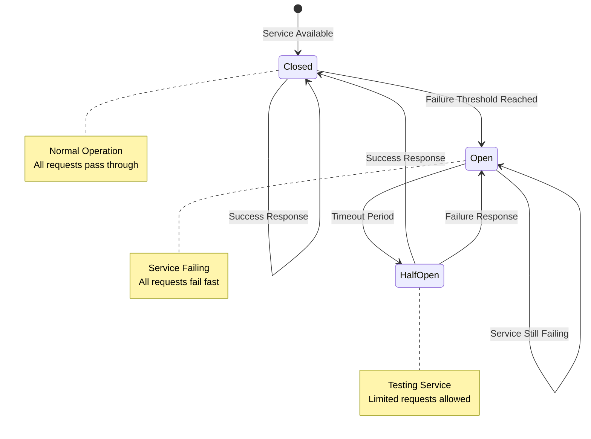
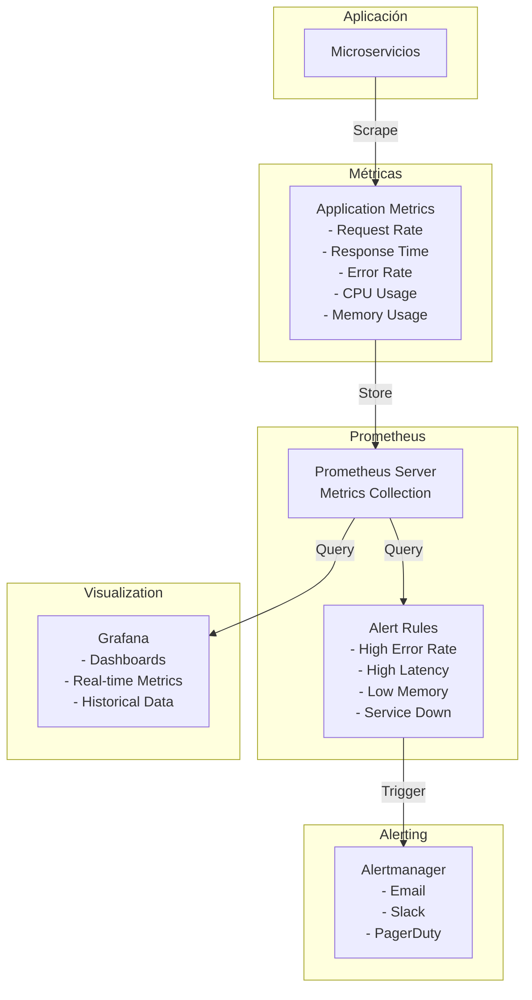

# Diagramas de Arquitectura - Microservices Application

## 🏗️ Diagrama de Arquitectura General

## 🔄 Flujo de Datos - Autenticación

## 🔄 Flujo de Datos - Gestión de TODOs

## 🏢 Infraestructura - Azure Container Apps

## 🔄 CI/CD Pipeline

## 📊 Observabilidad - Stack Completo

## 🔒 Seguridad - Arquitectura de Seguridad

## 🚀 Escalabilidad - Patrones de Escalado

## 🔄 Circuit Breaker Pattern

## 📈 Monitoreo - Métricas y Alertas

---

*Estos diagramas proporcionan una visión completa de la arquitectura del sistema de microservicios, incluyendo flujos de datos, infraestructura, seguridad, escalabilidad y monitoreo.*
