# Diagramas de Arquitectura - Microservicios

## 📋 Tabla de Contenidos

1. [Arquitectura General del Sistema](#arquitectura-general-del-sistema)
2. [Arquitectura de Desarrollo](#arquitectura-de-desarrollo)
3. [Arquitectura de Producción](#arquitectura-de-producción)
4. [Flujo de Datos y Comunicación](#flujo-de-datos-y-comunicación)
5. [Arquitectura de Seguridad](#arquitectura-de-seguridad)
6. [Arquitectura de Monitoreo](#arquitectura-de-monitoreo)
7. [Arquitectura de CI/CD](#arquitectura-de-cicd)
8. [Arquitectura de Infraestructura](#arquitectura-de-infraestructura)

---

## 🏗️ Arquitectura General del Sistema

### Diagrama de Alto Nivel

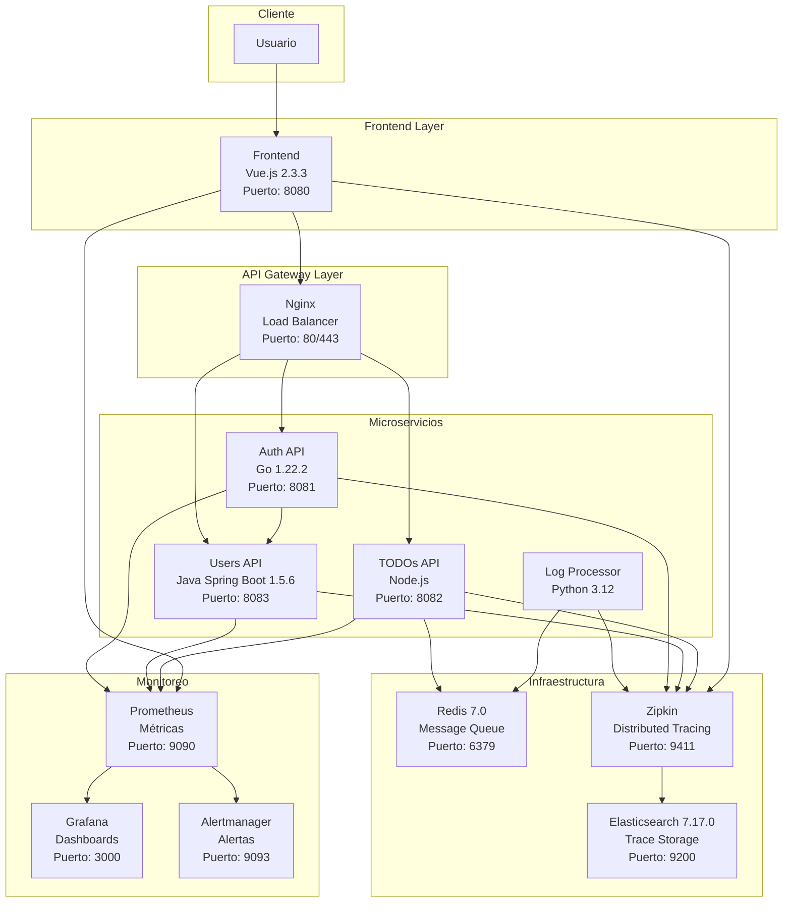

### Componentes y Responsabilidades

| Componente | Tecnología | Puerto | Responsabilidad |
|------------|------------|--------|-----------------|
| **Frontend** | Vue.js 2.3.3 | 8080 | Interfaz de usuario, gestión de estado |
| **Auth API** | Go 1.22.2 | 8081 | Autenticación, JWT tokens, Circuit Breaker |
| **Users API** | Java Spring Boot 1.5.6 | 8083 | Gestión de usuarios, roles, H2 DB |
| **TODOs API** | Node.js | 8082 | CRUD tareas, Cache Aside, Redis Pub/Sub |
| **Log Processor** | Python 3.12 | - | Procesamiento asíncrono de logs |
| **Redis** | Redis 7.0 | 6379 | Message queue, cache |
| **Zipkin** | Zipkin | 9411 | Distributed tracing |
| **Elasticsearch** | ES 7.17.0 | 9200 | Almacenamiento de traces |

---

## 🛠️ Arquitectura de Desarrollo

### Docker Compose - Desarrollo Local

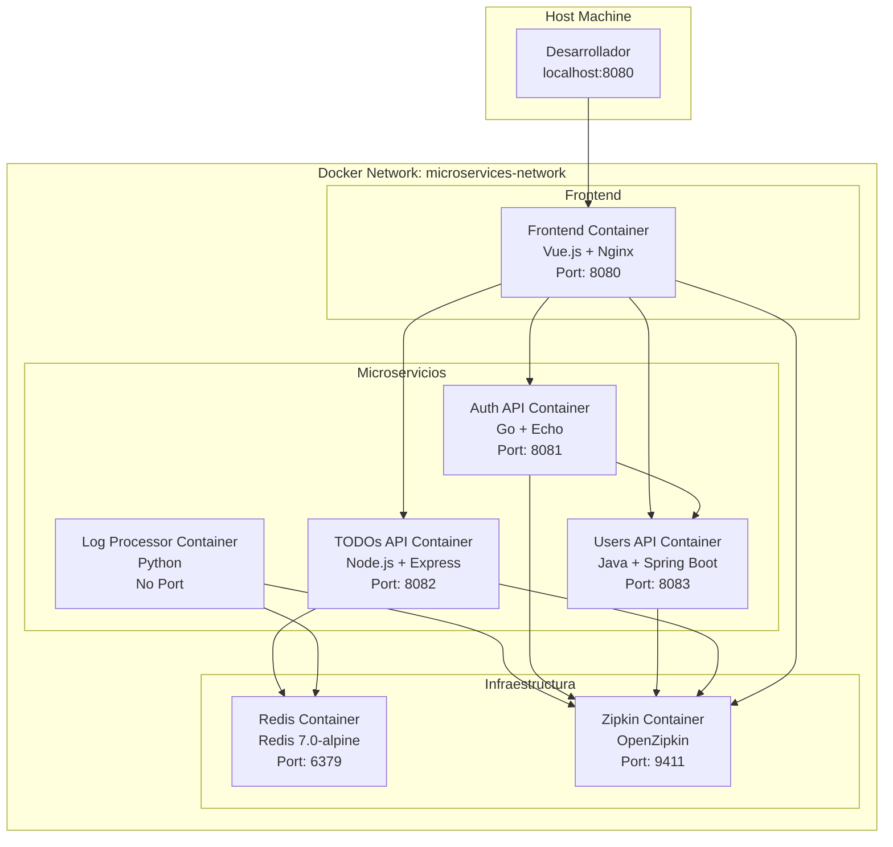

### Configuración de Red

```yaml
# docker-compose.yml
networks:
  microservices-network:
    driver: bridge
```

**Características del Desarrollo:**
- **Red aislada**: `microservices-network` (bridge)
- **Puertos expuestos**: Solo los necesarios para desarrollo
- **Volúmenes**: Código montado para hot-reload
- **Variables de entorno**: Configuración de desarrollo

---

## 🚀 Arquitectura de Producción

### Docker Compose - Producción

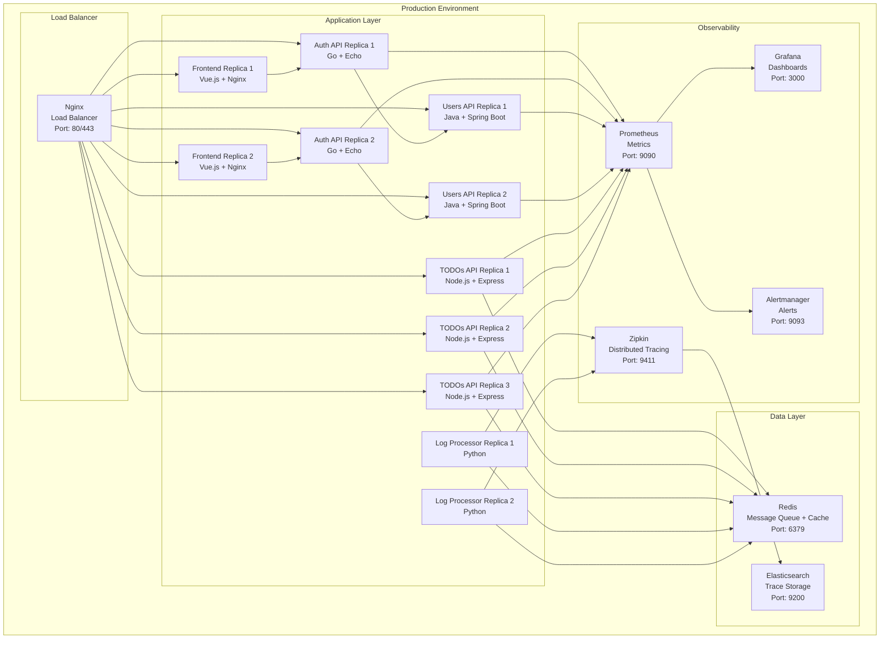

### Configuración de Réplicas

```yaml
# docker-compose-prod.yml
deploy:
  replicas: 2  # Frontend, Auth API, Users API, Log Processor
  replicas: 3  # TODOs API (mayor carga)
  resources:
    limits:
      memory: 256M-512M
    reservations:
      memory: 128M-256M
```

---

## 🔄 Flujo de Datos y Comunicación

### Flujo de Autenticación

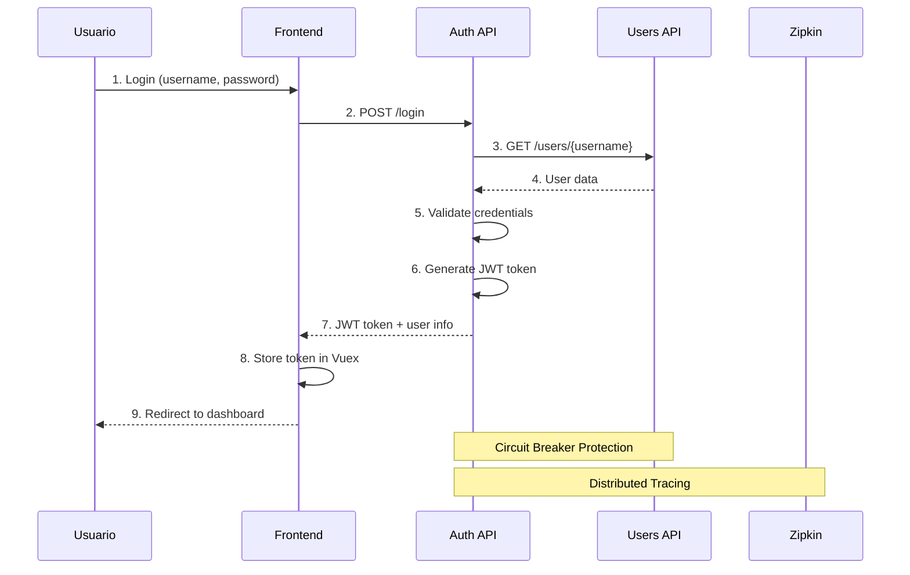

### Flujo de Operaciones TODOs

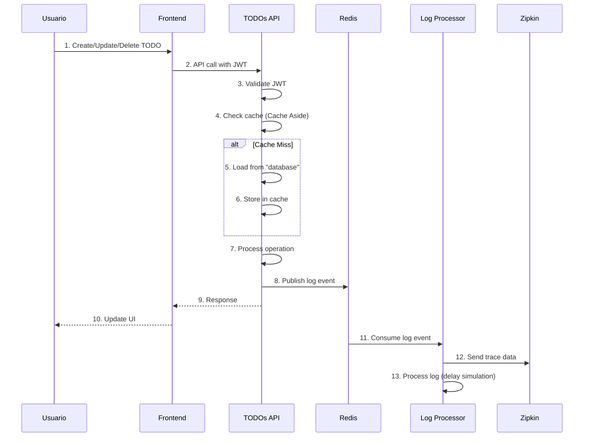

### Patrones de Comunicación

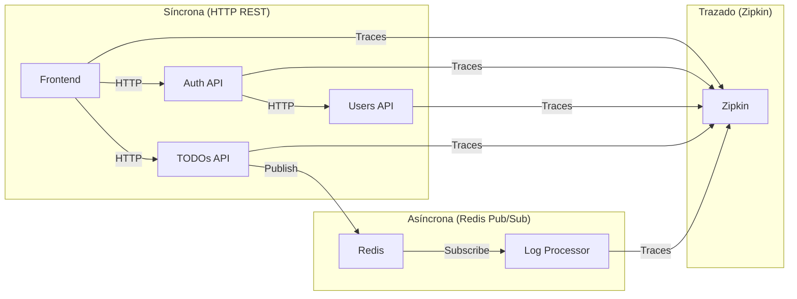

---

## 🔒 Arquitectura de Seguridad

### Autenticación y Autorización

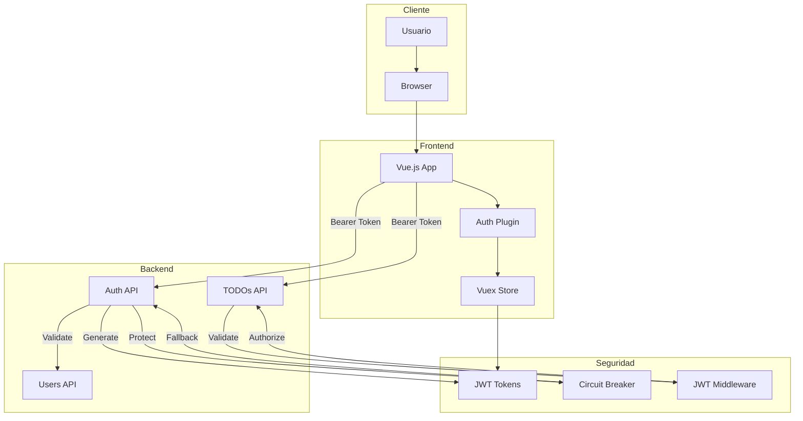

### Flujo de Seguridad JWT

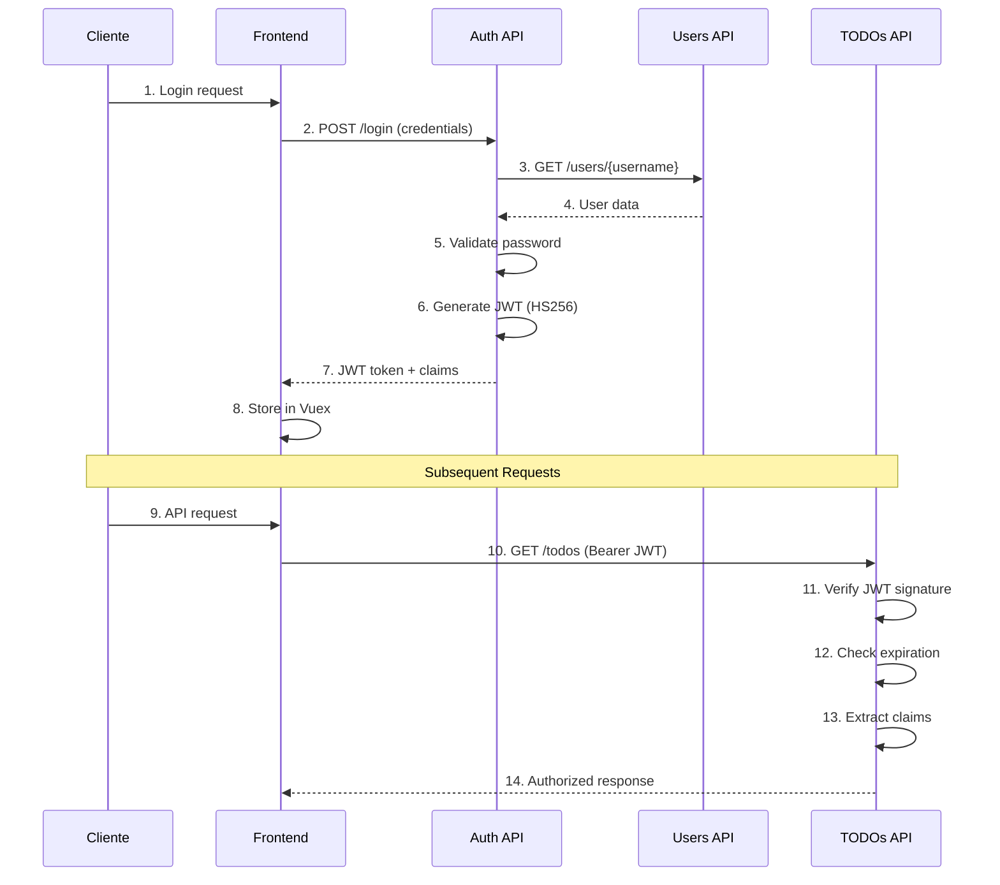

---

## 📊 Arquitectura de Monitoreo

### Stack de Observabilidad

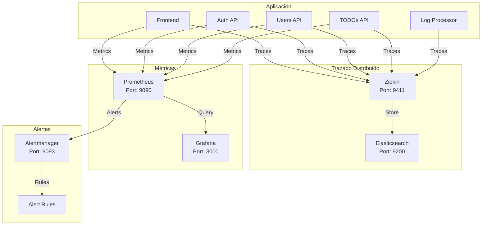

### Configuración de Métricas

```yaml
# monitoring/prometheus.yml
scrape_configs:
  - job_name: 'todos-api'
    static_configs:
      - targets: ['todos-api:8082']
    metrics_path: '/metrics'
    scrape_interval: 5s
    
  - job_name: 'users-api'
    static_configs:
      - targets: ['users-api:8083']
      
  - job_name: 'auth-api'
    static_configs:
      - targets: ['auth-api:8081']
```

---

## 🚀 Arquitectura de CI/CD

### GitHub Actions Pipeline

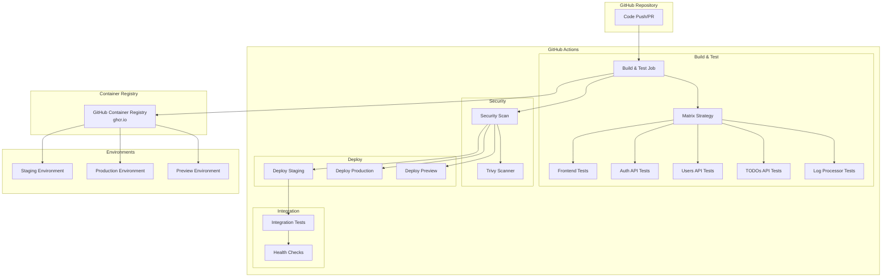

### Pipeline Stages

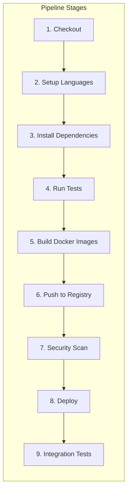

---

## ☁️ Arquitectura de Infraestructura

### Azure + Terraform

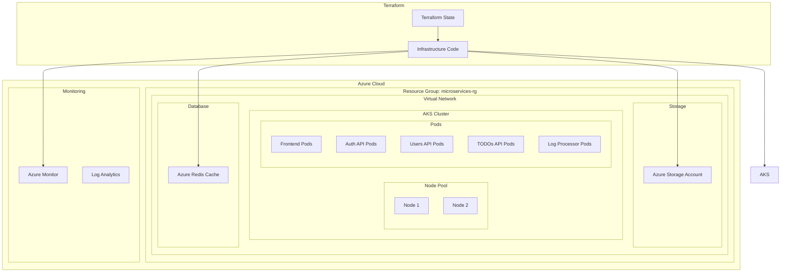

### Terraform Configuration

```hcl
# infrastructure/main.tf
resource "azurerm_kubernetes_cluster" "microservices" {
  name                = "microservices-aks"
  location            = azurerm_resource_group.microservices.location
  resource_group_name = azurerm_resource_group.microservices.name
  dns_prefix          = "microservices"
  
  default_node_pool {
    name       = "default"
    node_count = 2
    vm_size    = "Standard_D2s_v3"
  }
  
  identity {
    type = "SystemAssigned"
  }
}
```

---

## 🔧 Patrones de Diseño Implementados

### 1. Circuit Breaker Pattern

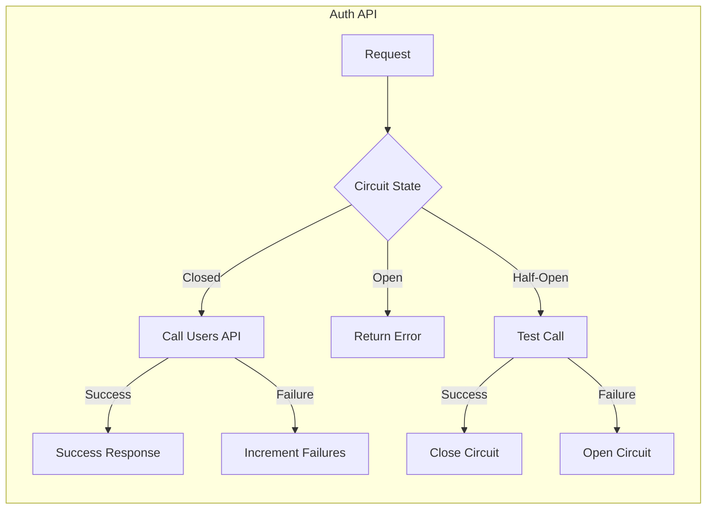

### 2. Cache Aside Pattern

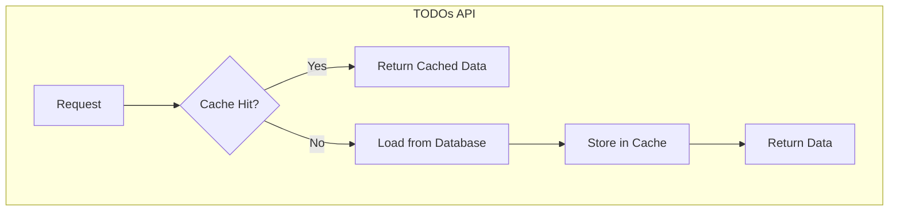

### 3. Auto Scaling Pattern

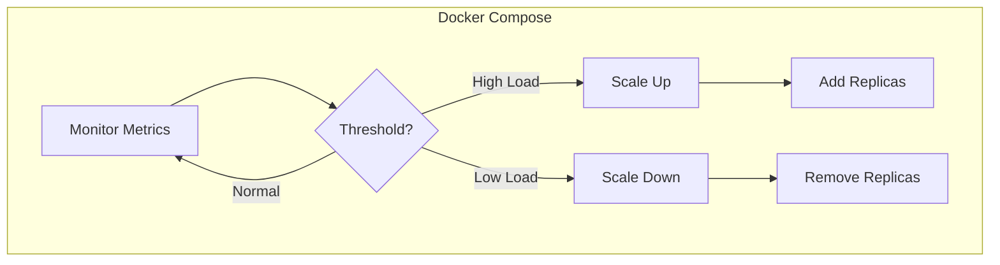

---

## 📈 Métricas y KPIs

### Métricas de Aplicación

| Métrica | Valor Objetivo | Implementación |
|---------|----------------|----------------|
| **Latencia P95** | < 500ms | Prometheus + Grafana |
| **Throughput** | 100 req/s | Prometheus scraping |
| **Disponibilidad** | 99.9% | Health checks |
| **Error Rate** | < 1% | Circuit breaker |

### Métricas de Infraestructura

| Métrica | Valor Objetivo | Herramienta |
|---------|----------------|-------------|
| **CPU Usage** | < 70% | Prometheus |
| **Memory Usage** | < 80% | Prometheus |
| **Disk Usage** | < 85% | Prometheus |
| **Network Latency** | < 100ms | Prometheus |

---

## 🎯 Resumen de Arquitectura

### Características Principales

1. **Microservicios Políglotas**: 5 servicios en diferentes tecnologías
2. **Comunicación Híbrida**: HTTP REST + Redis Pub/Sub
3. **Observabilidad Completa**: Zipkin + Prometheus + Grafana
4. **Seguridad JWT**: Autenticación centralizada
5. **Patrones de Resiliencia**: Circuit Breaker, Cache Aside, Auto Scaling
6. **Infraestructura como Código**: Terraform + Docker Compose
7. **CI/CD Automatizado**: GitHub Actions con multi-language support

### Beneficios de la Arquitectura

- **Escalabilidad**: Servicios independientes escalables
- **Resiliencia**: Patrones de fallo y recuperación
- **Observabilidad**: Trazado distribuido y métricas
- **Seguridad**: JWT y validación centralizada
- **Mantenibilidad**: Código modular y testeable
- **Despliegue**: Automatizado y confiable

---

*Esta documentación de diagramas de arquitectura refleja la implementación real del sistema de microservicios, basada en el código fuente y configuraciones actuales del proyecto.*
