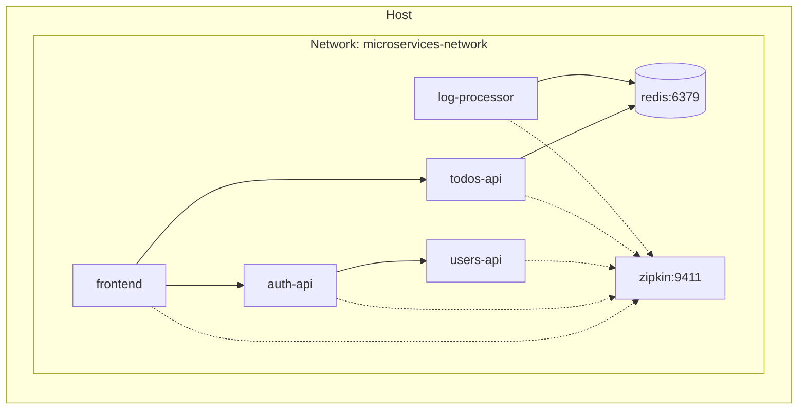
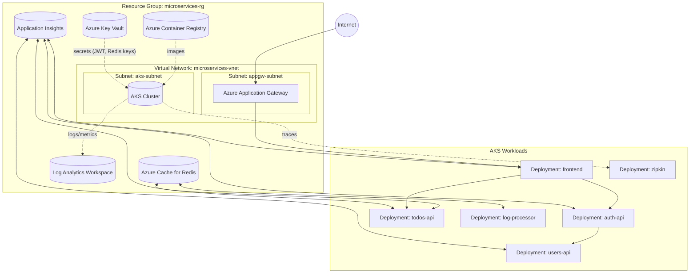

## Arquitectura - Microservice App Example

### 1) Diagrama de Contexto
```mermaid
flowchart LR
  User[Usuario] -->|Navega| Frontend[Frontend (Vue)]
  Frontend -->|Login| AuthAPI[Auth API (Go)]
  AuthAPI -->|Valida credenciales| UsersAPI[Users API (Spring Boot)]
  Frontend -->|CRUD Todos (JWT)| TodosAPI[Todos API (Node)]
  TodosAPI -->|Publica eventos| Redis[(Redis Pub/Sub)]
  LogProc[Log Message Processor (Python)] -->|Suscribe| Redis
  %% Observabilidad
  Frontend -. Zipkin spans .-> Zipkin[Zipkin]
  AuthAPI -. Zipkin spans .-> Zipkin
  UsersAPI -. Zipkin spans .-> Zipkin
  TodosAPI -. Zipkin spans .-> Zipkin
  LogProc -. Zipkin spans .-> Zipkin
```

### 2) Diagrama de Componentes/Contenedores
```mermaid
graph TB
  subgraph UI
    FE[Frontend (Vue)]
  end
  subgraph Backend
    A[Auth API (Go)]
    U[Users API (Spring Boot)]
    T[Todos API (Node.js)]
    L[Log Processor (Python)]
  end
  subgraph Infra
    R[(Redis)]
    Z[Zipkin]
  end

  FE -->|/login| A
  A -->|/users (perfil)| U
  FE -->|/todos (JWT)| T
  T -->|pub "create/delete"| R
  L -->|sub "log_channel"| R

  FE -. traces .-> Z
  A  -. traces .-> Z
  U  -. traces .-> Z
  T  -. traces .-> Z
  L  -. traces .-> Z
```

### 3) Despliegue (Docker Compose)


### 4) CI/CD (GitHub Actions) – Flujo
```mermaid
flowchart TD
  push{{Push/PR}} --> CI[Build & Test (matrix: 5 servicios)]
  CI --> Scan[Security Scan (Trivy)]
  Scan -->|branch=develop| Staging[Deploy Staging]
  Scan -->|branch=main| Prod[Deploy Production]
  Staging --> IT[Integration Tests]
```

### 5) Patrones aplicados y sugeridos
- Existentes: JWT Auth, Event-Driven (Redis), Tracing distribuido (Zipkin)
- Sugeridos: Circuit Breaker, Cache-Aside

### 6) Arquitectura en Azure (nube)


Notas:
- El pipeline construye imágenes en ACR y las despliega en AKS.
- Secretos (p. ej., `JWT_SECRET`, claves de Redis) se referencian desde Key Vault (mediante CSI driver o sincronización de secretos).
- App Gateway expone el frontend y enruta al backend en AKS.
- Redis es un servicio administrado de Azure Cache for Redis.
- Observabilidad con Log Analytics y Application Insights; Zipkin corre como pod en AKS.

### 7) Cómo visualizar/exportar
- Vista rápida: abrir este archivo en un editor con soporte Mermaid (VS Code + extensión Mermaid).
- Online: pegar cada bloque en `https://mermaid.live`.
- Exportar: desde la extensión de VS Code o mermaid-cli.


