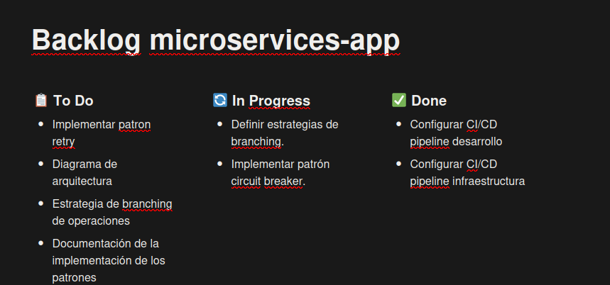

# Estrategia de Branching basada en Scrum

Para este proyecto de microservicios, seguimos una estrategia de branching alineada con la metodología ágil **Scrum**. El objetivo es facilitar la colaboración, integración continua y entrega frecuente de valor.

## Branches principales

- **main**  
  Rama principal y estable. Contiene el código listo para producción. Solo se actualiza mediante Pull Requests (PR) revisados y aprobados.

- **develop**  
  Rama de integración para desarrollo. Aquí se integran las nuevas funcionalidades antes de pasar a producción.

## Branches de trabajo

- **feature/\***  
  Cada nueva funcionalidad se desarrolla en una rama `feature/nombre-feature`. Estas ramas se crean desde `develop` y, una vez finalizadas y revisadas, se integran mediante PR a `develop`.

- **bugfix/\***  
  Correcciones de errores detectados en desarrollo se realizan en ramas `bugfix/nombre-bug`. Se crean desde `develop` y se integran a `develop` tras revisión.

- **hotfix/\***  
  Correcciones urgentes en producción se realizan en ramas `hotfix/nombre-hotfix`. Se crean desde `main` y, tras ser aprobadas, se integran tanto a `main` como a `develop`.

## Flujo de trabajo Scrum

- Al inicio de cada sprint, el equipo selecciona las tareas del backlog y crea las ramas correspondientes (`feature/`, `bugfix/`).
- Las ramas se integran a `develop` mediante PR y revisión por pares.
- Al finalizar el sprint, se realiza una integración de `develop` a `main` para liberar la versión estable.
- Los cambios urgentes en producción se gestionan con ramas `hotfix/`.

Esta estrategia permite mantener la calidad y trazabilidad del código, facilitando la colaboración en equipos ágiles y la entrega continua en proyecto de microservicios.